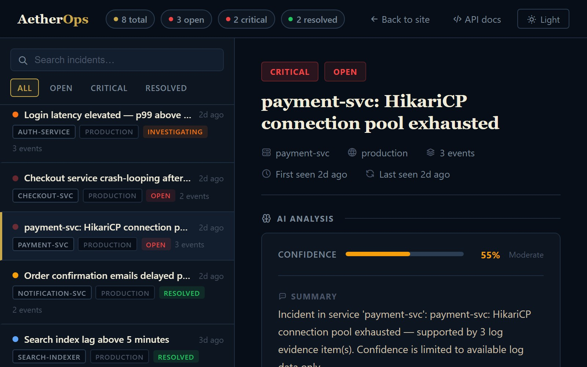
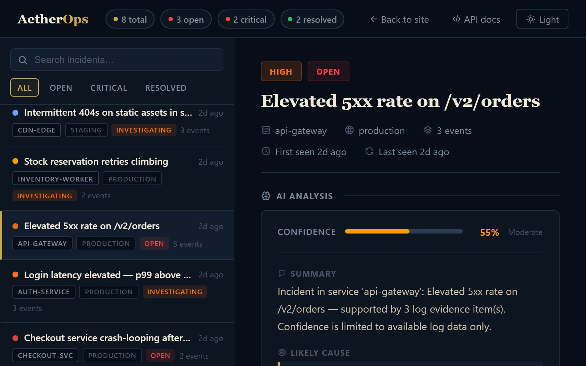

# AetherOps

**AI-assisted incident investigation for backend teams.** AetherOps groups related log failures into one incident, ties every claim in its analysis to a specific log line, and lists what it *can't* determine instead of guessing.

**Live:** [aetheropsai.com](https://aetheropsai.com)

The screenshot above is the running app, not a mockup. Seeded log events went through the real ingestion, grouping and analysis pipeline.

## What it does

1. **Ingest.** Services send structured log events to `POST /api/v1/events`. Secrets and tokens are masked before anything is stored.
2. **Group.** WARN, ERROR and FATAL events are fingerprinted by tenant, service, level and normalized message. Repeats join the same open incident instead of creating a new one, and severity escalates as the event count grows.
3. **Analyze.** The evidence is passed to an analysis engine that returns a structured result: summary, likely cause, confidence, unknowns and recommended next checks. The engine is pluggable, with a deterministic mock provider by default and Claude when an API key is set.
4. **Cite.** Every claim must reference an evidence ID. The returned summary and likely cause are checked against the cited log evidence before they are shown.
5. **Be honest about gaps.** Missing metrics, traces or deployment history are listed as unknowns, and suggested next checks are read-only diagnostics.

## Engineering highlights

- **Multi-tenant isolation in the database.** Every tenant-scoped table uses Postgres row-level security, enforced against the app's own database role, not only in application code.
- **Real-database tests.** 1,137 automated tests pass, and tenant isolation is tested against a real Postgres instance with RLS enforced rather than mocked.
- **Security basics done properly.** API keys are shown once and stored as SHA-256 hashes. Ingestion is rate-limited per key. TOTP 2FA uses constant-time comparison, and OAuth tokens are encrypted at rest with AES-256.
- **Account security.** Google OAuth login with account linking, account lockout after 5 failed attempts with a 15-minute auto-unlock, and an audit log of every AI operation.
- **Runbooks and postmortems.** Read-only runbook steps (no destructive suggestions) and postmortem drafts generated from the incident's evidence.
- **Incident lifecycle beyond analysis.** War rooms open automatically for CRITICAL incidents and are linked to Slack. On-call rotations are calendar-aware, with PTO-aware availability and masked phone numbers. Jira and ServiceNow tickets can be created from an incident, and SSO/SAML is supported per tenant.
- **Usage limits per plan.** Monthly caps on analyses, runbook generations and postmortem drafts are enforced by the system.

## Stack

Java 17, Spring Boot, PostgreSQL (with RLS), Redis, Flyway migrations, JWT auth. Deployed on Google Cloud Run with Cloud SQL, built with Cloud Build. A React Native mobile client exists for the API.

## Honest status

- War rooms, on-call and analytics are implemented in the backend API but don't have a web dashboard page yet. The landing page shows them as design mockups and labels them as such.
- Access is invite-only. There is no self-serve signup, so the live site is a landing page plus screenshots rather than a public sandbox.
- The source code is in a private repository. This repo is a showcase. I'm happy to walk through the code, architecture and design decisions in an interview.

## Contact

Zeyt Ates, IT engineering student in Poznań, Poland, looking for Java backend roles.
[LinkedIn](https://linkedin.com/in/zeytates) · [GitHub](https://github.com/akhilleusn)
